#  Laserwolve Games

### _**Making Games that People Want to Play**_

*The official GitHub organization for Laserwolve Games*

---

## 🎮 About Us

Laserwolve Games is an innovative game development studio dedicated to creating engaging, high-quality gaming experiences. We combine cutting-edge technology with creative storytelling to bring unique worlds to life.

## 🌟 What We Do

- **Game Development** - Creating immersive gaming experiences across multiple platforms
- **Open Source Tools** - Contributing to the gaming community with useful development tools
- **Innovation** - Pushing the boundaries of what's possible in interactive entertainment

## ⚒️ Current Projects

  <table>
    <tr>
      <td align="center">
        
      </td>
      <td align="center">
        
      </td>
    </tr>
    <tr>
      <td align="center">
        
      </td>
      <td align="center">
        
      </td>
    </tr>
  </table>

## 📖 Repository Architecture

```mermaid
graph TD
    A[🐺 Laserwolve Games] --> B[Games]
    A --> C[In-House Tools]
    B --> H[DaggerQuest]
    H --> F[DaggerQuest.com]
    H --> G[DaggerQuest Test Realm]
    B --> E[Plains of Shinar]
    C --> I[Overlord]
    C --> J[CAFfiene]
    H --> K[DaggerTest]
    A --> L[LaserwolveGames.com]
```

## 📫 Our Website

### [LaserwolveGames.com](https://LaserwolveGames.com)

## 📄 Licenses

Unless otherwise specified, our projects are released under various open source licenses. Check individual repositories for specific licensing information.
